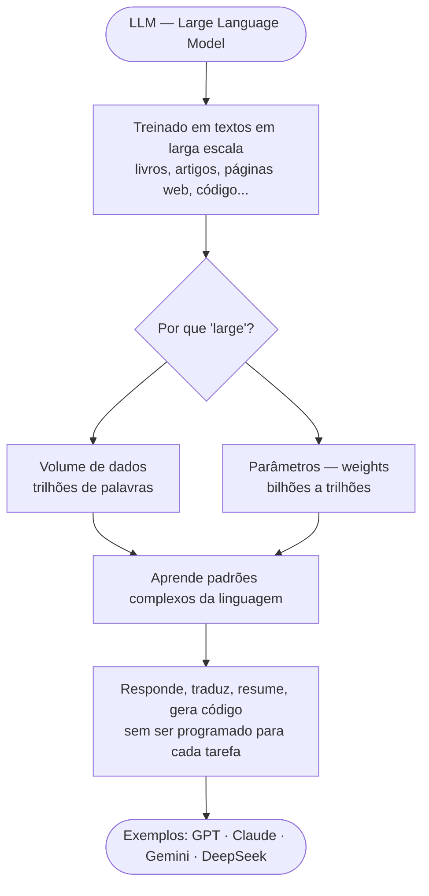

## 1. O que é um LLM?

LLM é a sigla para *Large Language Model* — em português, **Modelo de Linguagem de Grande Escala**. Trata-se de um sistema computacional treinado em um volume enorme de dados textuais para processar e gerar linguagem natural: português, inglês, código de programação, entre outros.

O adjetivo *large* (grande) no nome não é apenas um detalhe de marketing, refere-se a duas dimensões principais do modelo:

1. **Volume de dados de treinamento**: textos na escala de trilhões de palavras, extraídos de livros, artigos, páginas da web, código-fonte e muito mais. Essa diversidade e quantidade de dados permitem que o modelo aprenda uma representação rica e abrangente da linguagem humana, incluindo nuances, estilos, fatos e padrões de raciocínio.
2. **Número de parâmetros**: os chamados *weights* (pesos) do modelo, que são valores numéricos que controlam a força de influência entre as unidades de texto e que surgem do próprio processo de treinamento. Pense neles como a **memória aprendida** do modelo — é neles que ficam codificadas as relações entre palavras, frases e conceitos. Modelos modernos operam na faixa de bilhões a trilhões de parâmetros, o que lhes confere uma capacidade impressionante de compreensão e geração de texto.

Na prática, o que isso significa? Significa que um LLM consegue responder perguntas, traduzir idiomas, resumir textos, gerar código e manter conversas coerentes — **sem ter sido explicitamente programado para nenhuma dessas tarefas**. Esse comportamento emerge do treinamento em larga escala: ao ser exposto a padrões complexos da linguagem, o modelo aprende a aplicá-los de forma flexível às mais variadas situações.

Os exemplos mais proeminentes atualmente incluem GPT (OpenAI), Claude (Anthropic), DeepSeek (DeepSeek), Gemini (Google). Todos eles são LLMs, mas cada um tem suas particularidades em termos de arquitetura, dados de treinamento e capacidades específicas. O que os une é a base comum de serem modelos de linguagem treinados em larga escala, capazes de generalizar para uma ampla gama de tarefas linguísticas.

Resumo visual:


---

## 2. A diferença entre LLMs e modelos de NLP tradicionais

Para entender o que torna os LLMs tão poderosos, é necessário situá-los dentro da história do Processamento de Linguagem Natural (NLP).

### 2.1 Uma linha do tempo nos avanços do NLP

**Anos 1950–1960:** o famoso matemático Alan Turing (e também conhecido como o pai da computação moderna) lançou uma pergunta que definiria décadas de pesquisa — "As máquinas podem pensar?" (1950) — e propôs o Teste de Turing, no qual uma máquina tentaria se passar por um ser humano em conversa. Logo em seguida, surgiram os primeiros sistemas concretos de processamento de linguagem, como o **Experimento Georgetown-IBM (1953)**, que tentava traduzir automaticamente frases do russo para o inglês. Esses esforços corriam em paralelo a um movimento maior: a fundação do campo da Inteligência Artificial. Foi na Conferência de Dartmouth que John McCarthy cunhou o termo "inteligência artificial", e, logo após, o Processamento de Linguagem Natural — NLP — consolidou-se como uma de suas subáreas centrais..

A abordagem dominante da época era baseada em **regras escritas manualmente por linguistas**: gramáticas formais, dicionários bilíngues, parsers sintáticos rudimentares. A ideia central era tratar a língua como um sistema lógico — se você descrevesse todas as regras com precisão suficiente, a máquina poderia seguir. Havia forte interesse em tradução automática, especialmente no contexto da Guerra Fria, com ênfase no par inglês–russo.

O problema é que regras não escalam. A língua real é ambígua, contextual, evolutiva e altamente variável — qualquer construção não prevista simplesmente quebrava o sistema. Havia ainda uma limitação de poder computacional da época: por exemplo, o IBM 701, usado no Experimento Georgetown-IBM, é inferior a qualquer smartphone moderno, que possui milhões de vezes mais poder de processamento e memória.

O acúmulo desses fracassos culminou no **Relatório ALPAC (1966)**, uma avaliação crítica que concluiu que a tradução automática estava longe de ser viável. O resultado foi imediato: cortes significativos de financiamento e um redirecionamento da área para tarefas mais restritas e controláveis. O chamado **primeiro inverno da IA** teve início, e o campo de NLP ficou estagnado por quase uma década.

**Exemplo: Georgetown-IBM Project (1953)**


*Figura: Exemplo do fluxo lógico do projeto de tradução Georgetown-IBM. Fonte: Ornstein, Jacob. "Mechanical Translation: New Challenge to Communication". Science, vol. 122, issue 3173, pp. 745-748, 21 Oct 1955.*

### Exemplo: Chomsky, N. - Syntactic Structures (1957)
*Fonte original:** Chomsky, N. (1957). *Syntactic Structures*. Mouton & Co.
 
Noam Chomsky publicou *Syntactic Structures* em 1957, propondo que a linguagem humana poderia ser descrita por **gramáticas formais** — conjuntos de regras de reescrita que geram todas as frases gramaticalmente válidas de uma língua.
 
A hierarquia de Chomsky classifica gramáticas por poder expressivo. Para NLP, a mais relevante era a **gramática livre de contexto** (*Context-Free Grammar* — CFG), onde cada regra tem a forma:
 
```
símbolo_não-terminal → sequência de símbolos
```
 
**Exemplo de gramática para frases simples em português:**

Na frase: "O gato bebeu leite", a estrutura sintática pode ser representada por regras como:
 
```
S  → NP VP
NP → Det N
VP → V NP
Det → "o" | "a" | "um" | "uma"
N  → "gato" | "rato" | "leite"
V  → "bebeu" | "viu" | "comeu"
```

Em resumo: `S` é o símbolo inicial que representa uma frase completa. `NP` (frase nominal) e `VP` (frase verbal) são símbolos não-terminais que podem ser expandidos usando as regras. `Det`, `N` e `V` são símbolos terminais que correspondem a palavras reais.
 
Com essas regras, o sistema consegue **gerar** (e **verificar**) frases como:
 
```
S
├── NP: "o gato"
│     ├── Det: "o"
│     └── N:   "gato"
└── VP: "bebeu o leite"
      ├── V:  "bebeu"
      └── NP: "o leite"
            ├── Det: "o"
            └── N:   "leite"
```
 
E rejeita (não deriva) frases como:
 
```
"gato o leite bebeu o"  →  ✗ (não derivável pelas regras)
```
 
*O problema:* a regra `NP → Det N` não sabe nada sobre o mundo. Ela aceita igualmente "o gato bebeu leite" e "o leite bebeu gato" — ambas são gramaticalmente válidas pela gramática, mas apenas uma faz sentido semanticamente. Regras sintáticas não capturam significado.

**Anos 1970–1980:** Aprofundaram a aposta na abordagem simbólica. Sistemas especialistas e redes semânticas tentavam representar o conhecimento do mundo de forma estruturada — o projeto SHRDLU, por exemplo, conseguia manipular objetos em ambientes virtuais usando linguagem natural. Funcionava, mas apenas dentro de domínios fechados e controlados. Fora deles, o sistema simplesmente não sabia o que fazer. Em paralelo, começavam a surgir os primeiros esforços de corpora anotados — coleções de textos marcados manualmente com informações linguísticas - incluindo os trabalhos iniciais que culminariam no Penn Treebank, publicado formalmente em 1992–1993. A limitação dos sistemas simbólicos, somada a expectativas infladas, levou a ciclos de redução de financiamento. O chamado **segundo inverno da IA** teve início no final dos anos 1980 e se estendeu até meados dos anos 1990.


*Figura: Exemplo da interface do SHRDLU, um sistema de NLP simbólico desenvolvido no MIT por Terry Winograd (1968 e 1970). O usuário pode digitar comandos em linguagem natural para manipular objetos em um ambiente virtual.*

**Anos 1990:** O campo passou por uma transição para **métodos estatísticos baseados em dados**. Em vez de codificar regras explicitamente, modelos aprendem padrões a partir de grandes corpora. Técnicas como modelos de linguagem n-grama e Hidden Markov Models (HMMs) tornaram-se centrais em tarefas como tagging e reconhecimento de fala. Representações como Bag of Words (BoW) e TF-IDF permitem transformar texto em vetores numéricos. Esses métodos são escaláveis e robustos, mas limitados: ignoram semântica profunda e dependem fortemente de frequência e coocorrência. Ainda assim, muitos sistemas permaneceram híbridos, combinando estatística e regras.

**Anos 2000:** Com bases estatísticas mais sólidas, algoritmos como SVM (*Support Vector Machines*), Naive Bayes e CRFs (*Conditional Random Fields*) dominaram o estado da arte em tarefas específicas — classificação de texto, análise de sentimento, reconhecimento de entidades nomeadas. O NLP passou a ser estruturado como **pipelines** sequenciais: `tokenização → anotação gramatical → extração de features → modelo`. Cada etapa alimentava a seguinte.

Esses sistemas funcionavam bem dentro do domínio em que foram treinados. O problema é que eram altamente dependentes de engenharia manual — alguém precisava decidir quais features extrair, como representar o texto, quais regras aplicar. E cada nova tarefa exigia recomeçar esse processo do zero: um novo modelo, novas features, novos dados rotulados.

Ainda nesse período, mas por um caminho diferente, as redes neurais recorrentes — as **RNNs** — ganhavam força como uma alternativa à engenharia manual. Em vez de extrair features à mão, elas processavam o texto como uma sequência, mantendo um estado interno que se atualizava a cada palavra. A ideia era capturar dependências ao longo do tempo: o que veio antes influencia o que vem depois.

O problema é que, na prática, RNNs simples tinham dificuldade em manter informação por sequências longas — o chamado problema do gradiente desvanecente. A solução veio com as **LSTMs** (*Long Short-Term Memory*, Hochreiter & Schmidhuber, 1997), que introduziram mecanismos de memória explícita, controlando o que guardar e o que descartar. As LSTMs dominaram tarefas como reconhecimento de fala, tradução e geração de texto ao longo dos anos 2000 e início dos 2010. Eram poderosas, mas lentas: o processamento sequencial impedia paralelização, o que limitava a escala.

**Anos 2013–2014:** Os embeddings mudaram a base da representação. **Word2Vec (2013)** e **GloVe (2014)** aprendiam vetores densos para palavras com base em seu contexto de uso — em vez de representar palavras como categorias isoladas, passaram a representá-las como pontos num espaço matemático. Palavras semanticamente semelhantes ocupam regiões próximas nesse espaço, o que permitia capturar relações sutis, como analogias: o exemplo clássico é `rei − homem + mulher ≈ rainha`, demonstrando que o modelo aprendeu a relação entre os conceitos, não apenas a frequência de palavras.

O avanço era real, mas havia um limite importante. Esses embeddings são *context-free*: cada palavra recebe uma única representação fixa, independentemente do contexto em que aparece. A palavra "banco" — seja uma instituição financeira ou um assento de praça — recebia exatamente o mesmo vetor. O modelo não distinguia.

**2017:** O **Transformer** — introduzido no artigo *Attention Is All You Need* (Vaswani et al., 2017) — redefiniu a arquitetura dominante. Em vez de processar o texto palavra por palavra, como faziam as RNNs e LSTMs, ele opera com um mecanismo de *self-attention*: cada token considera todos os outros simultaneamente, produzindo representações contextuais dinâmicas. A palavra "banco" agora recebe uma representação diferente dependendo do que está ao redor dela.

Além disso, ao eliminar a recorrência, o Transformer permitiu que o treinamento fosse altamente paralelizável — diferentes partes do texto podem ser processadas ao mesmo tempo, em vez de sequencialmente. Foi essa característica que viabilizou escala sem precedentes: mais dados, mais parâmetros, mais poder computacional, tudo funcionando em conjunto.

**2018 em diante:** Com o Transformer como base, surgiu o paradigma do **pré-treinamento em larga escala**. O BERT aprendeu representações profundas de linguagem de forma bidirecional e passou a ser ajustado para tarefas específicas. Modelos da família GPT seguiram uma abordagem autorregressiva e generativa — em vez de preencher lacunas no meio de uma frase, aprenderam a continuar texto a partir de um ponto.

Com o GPT-3 (2020), o aumento de escala — mais dados, mais parâmetros, mais poder computacional — tornou evidente um fenômeno novo: o *in-context learning*, a habilidade de executar tarefas a partir de instruções ou poucos exemplos, sem nenhum treinamento adicional específico.

Ainda assim, esses modelos passam por etapas de refinamento após o pré-treinamento. No *instruction tuning*, o modelo é treinado com exemplos de instruções e respostas esperadas, aprendendo a seguir comandos de forma mais precisa. No RLHF (*Reinforcement Learning from Human Feedback*), avaliadores humanos classificam as respostas do modelo, e esse feedback é usado para ajustar o comportamento — tornando as respostas mais úteis, mais seguras e mais alinhadas ao que se espera de uma conversa real.

É nesse conjunto de técnicas que se estabelece a era dos LLMs: **modelos generalistas capazes de atuar em múltiplos domínios e tarefas, com mínima adaptação específica**.

**Resumo da evolução do NLP: das abordagens tradicionais aos LLMs**

| Época | Representação | Contexto | Generalização |
|---|---|---|---|
| Regras / simbólico (1950–80) | Explícita, manual | Inexistente | Nenhuma |
| BoW / TF-IDF (1990–2000) | Esparsa, por contagem | Inexistente | Nenhuma |
| Classificadores (2000–12) | Esparsa, por frequência | Local / inexistente | Limitada ao domínio |
| RNNs / LSTMs (1997–2017) | Sequencial, estado oculto | Sequencial, curto prazo | Limitada, por tarefa |
| Embeddings (2013–17) | Densa, por palavra | Fixo, sem sequência | Parcial (embedding reutilizável) |
| Transformer (2017) | Densa, por sequência inteira | Global (atenção completa) | Alta, via pré-treinamento |
| LLMs (2018–hoje) | Contextual, por token | Global + contexto longo | Ampla, via prompting |

Obviamente, essa linha do tempo é uma simplificação extrema. Muitos avanços ocorreram em paralelo, e a evolução do NLP é marcada por uma complexa interação de ideias, técnicas e contextos históricos. No entanto, mesmo bem simplificada, essa trajetória torna evidente um padrão recorrente: cada era foi limitada pelo que a anterior não conseguia capturar. Regras não escalam. Estatísticas ignoram semântica. Embeddings fixos ignoram contexto. RNNs não paralelizam. Os LLMs não "resolvem" NLP — eles simplesmente empurram essa fronteira de limitações para um lugar muito mais distante do que qualquer abordagem anterior havia conseguido.

### 2.2 O que torna os LLMs qualitativamente diferentes

Situar os LLMs na linha do tempo é útil, mas não é suficiente. A diferença não é apenas de grau — é de natureza. Alguns contrastes fundamentais:

**a) Pré-treinamento não supervisionado em larga escala:** modelos tradicionais exigem dados rotulados manualmente para cada tarefa — um processo caro, lento e limitado em volume. LLMs são treinados em tarefas auto-supervisionadas (tipicamente, prever o próximo token) sobre quantidades massivas de texto bruto, sem necessidade de anotação humana. A supervisão vem do próprio texto: o rótulo de cada token é o token seguinte. Isso permite escalar o treinamento para trilhões de exemplos sem custo de anotação humana.

**b) Emergência de capacidades:** a partir de certa escala, LLMs demonstram capacidades que não foram explicitamente ensinadas: raciocínio multi-etapas, analogias, aritmética básica, geração de código, seguimento de instruções complexas. Esse fenômeno é chamado de **emergência** (*emergent behavior*) — capacidades que simplesmente não existem em modelos menores e aparecem de forma abrupta conforme a escala aumenta. Não é completamente compreendido por que isso ocorre, e não tem paralelo em modelos tradicionais, que só realizam tarefas para as quais foram explicitamente treinados.

**c) Generalização zero-shot e few-shot:** um modelo tradicional treinado para análise de sentimento não serve para tradução. Um LLM pode executar ambas as tarefas — e dezenas de outras — sem nenhum retreinamento. Basta descrever a tarefa no prompt (*zero-shot*) ou fornecer alguns exemplos (*few-shot*). Essa generalização é qualitativamente diferente da que os sistemas anteriores ofereciam.

**d) Representação contextual dinâmica:** enquanto Word2Vec atribui um vetor fixo a cada palavra, os LLMs geram representações que variam conforme o contexto inteiro da sequência. A palavra "banco" em "fui ao banco sacar dinheiro" produz uma representação numericamente diferente da mesma palavra em "sentei no banco da praça" — o modelo distingue os dois usos porque processa toda a sequência de forma integrada.

Em resumo:

| Característica | Modelos Tradicionais | LLMs |
|---|---|---|
| Arquitetura base | Variada (SVM, RNN, n-gramas…) | Transformer |
| Escala de parâmetros | Milhões (ou menos) | Bilhões a trilhões |
| Paradigma de treinamento | Supervisionado por tarefa | Pré-treinamento auto-supervisionado |
| Dados necessários | Rotulados, por tarefa | Texto bruto em larga escala |
| Generalização | Fraca fora do domínio | Zero/few-shot robusta |
| Contexto capturado | Local ou ausente | Global (toda a sequência) |
| Representação de palavras | Fixa (context-free) | Dinâmica (contextual) |
| Capacidades emergentes | Não | Sim |

---

## 3. O que significa "modelo de linguagem"?

Antes da definição formal, vale fixar o conceito mais geral. Um **modelo**, em termos matemáticos, é uma função que transforma uma entrada em uma saída:

$$f(\text{entrada}) \rightarrow \text{saída}$$

No caso de um modelo de linguagem, tanto a entrada quanto a saída são texto. O que o modelo aprende é a função $f$ que mapeia sequências de tokens de entrada para saídas desejadas. Nos LLMs, essa função é extremamente complexa — parametrizada por bilhões ou trilhões de pesos — e o processo de treinamento consiste em ajustar esses pesos iterativamente até que as saídas do modelo se aproximem das saídas reais presentes no corpus de treinamento.

### 3.1 A definição formal

Formalmente, um **modelo de linguagem** é uma **distribuição de probabilidade sobre sequências de tokens**. Dado um vocabulário $V$ (o conjunto de todos os tokens possíveis), o modelo atribui uma probabilidade a qualquer sequência $w_1, w_2, \ldots, w_n$:

$$P(w_1, w_2, \ldots, w_n)$$

No caso aqui, $w_i$ representa o token na posição $i$ da sequência. A função $P$ é a distribuição de probabilidade que o modelo aprendeu a partir dos dados de treinamento.

Quanto maior essa probabilidade, mais "natural" ou "plausível" é a sequência segundo o que o modelo aprendeu da linguagem humana.

Por meio da **regra da cadeia de probabilidades**, essa distribuição conjunta — que seria impossível de calcular diretamente — é fatorada em etapas menores:

$$P(w_1, w_2, \ldots, w_n) = \prod_{i=1}^{n} P(w_i \mid w_1, w_2, \ldots, w_{i-1})$$

Cada fator $P(w_i \mid w_1, \ldots, w_{i-1})$ é a probabilidade do próximo token $w_i$, dado todo o contexto anterior. **Aprender um modelo de linguagem é, essencialmente, aprender a estimar esses fatores com precisão.**

#### Para entender sem ser matemático

Imagine que você está jogando uma partida de completar frases. Alguém escreve *"O gato subiu no..."* e te pede para adivinhar a próxima palavra. Você provavelmente diria *"telhado"*, *"sofá"* ou *"muro"* — e não *"helicóptero"* ou *"democracia"*. Por quê? Porque com base em tudo que você já leu e ouviu na vida, algumas continuações fazem sentido e outras não.

Um modelo de linguagem faz exatamente isso, mas com matemática. Ele aprendeu, a partir de enormes quantidades de texto, quais palavras (ou *tokens*) tendem a aparecer depois de quais outras. A cada passo, ele olha para tudo que foi escrito até agora e calcula: *"qual é a próxima peça mais provável?"*

A fórmula com o produtório $\prod$ é só a forma rigorosa de dizer isso: a probabilidade de uma frase inteira é o resultado de multiplicar, uma a uma, as probabilidades de cada palavra — sempre levando em conta todas as anteriores. Não é magia; é uma aposta bem informada, repetida token por token.

#### 3.1.1 Entendendo a fórmula passo a passo

A notação matemática pode parecer intimidadora, mas o raciocínio por trás dela é direto. Vamos desmontá-la com um exemplo concreto.

**O que é um token?**

Modelos não trabalham com palavras inteiras — trabalham com **tokens**, pedaços de texto que podem ser palavras, partes de palavras ou pontuação:

```
"Olá, mundo!"  →  ["Olá", ",", " mundo", "!"]
```

Cada token recebe um índice numérico em um vocabulário $V$, cujo tamanho típico é $|V| \approx 50.000$ tokens. Nos exemplos abaixo, vamos tratar token como sinônimo de palavra — a lógica é idêntica.

**O que é "distribuição de probabilidade sobre sequências"?**

Pense em um dado de seis faces: cada face tem probabilidade $\frac{1}{6}$ de sair. A distribuição descreve todas as possibilidades e suas chances. Exemplo: para um dado justo, a distribuição é:
| Face | Probabilidade |
|---|---|
| 1 | 0.1667 |
| 2 | 0.1667 |
| 3 | 0.1667 |
| 4 | 0.1667 |
| 5 | 0.1667 |
| 6 | 0.1667 |

> Obs.: a soma de todas as probabilidades é 1, porque uma das faces precisa sair. Todas as faces são igualmente prováveis, então cada uma tem a mesma chance.

Um modelo de linguagem faz o mesmo para frases — atribui uma probabilidade a cada sequência possível:

| Frase | Probabilidade |
|---|---|
| "O gato bebeu leite" | 0.0031 |
| "O gato bebeu cimento" | 0.000002 |
| "Cimento bebeu o gato" | 0.0000001 |
| "Xklpq mrt bzzz" | ≈ 0 |

Os números são minúsculos porque existem infinitas frases possíveis — a probabilidade total precisa somar 1, dividida entre todas elas. O que importa é a **ordem relativa**: frases naturais têm probabilidade muito maior do que frases sem sentido.

**Por que não calcular a probabilidade de uma frase diretamente?**

Porque é computacionalmente inviável. Uma frase de 10 palavras sobre um vocabulário de 50.000 tokens geraria $$50.000^{10} \approx 10^{47}$$ combinações possíveis — um número tão grande que nenhum sistema poderia enumerá-las ou armazená-las diretamente. Precisamos de uma estratégia mais inteligente.

**A regra da cadeia: dividir para conquistar**

A solução é decompor a probabilidade da frase inteira em uma sequência de probabilidades condicionais — uma por token, sempre condicionando ao que já foi visto. Com a frase "O gato bebeu leite":

1. Qual a probabilidade de a frase começar com "O"? → $P(\text{O})$
2. Dado que começa com "O", qual a probabilidade da próxima palavra ser "gato"? → $P(\text{gato} \mid \text{O})$
3. Dado "O gato", qual a probabilidade de "bebeu"? → $P(\text{bebeu} \mid \text{O, gato})$
4. Dado "O gato bebeu", qual a probabilidade de "leite"? → $P(\text{leite} \mid \text{O, gato, bebeu})$

O símbolo $\mid$ significa *"dado que"*. A probabilidade da frase inteira é simplesmente a **multiplicação de todas essas etapas**:

$$P(\text{"O gato bebeu leite"}) = P(\text{O}) \times P(\text{gato} \mid \text{O}) \times P(\text{bebeu} \mid \text{O, gato}) \times P(\text{leite} \mid \text{O, gato, bebeu})$$

O $\prod$ (pi maiúsculo) na fórmula geral é apenas a notação compacta para "multiplique todos esses fatores", para uma sequência de comprimento arbitrário. Visualmente:

```
Frase:   "O"       "gato"        "bebeu"          "leite"
          ↓           ↓              ↓                ↓
       P(O)  ×  P(gato|O)  ×  P(bebeu|O,gato)  ×  P(leite|O,gato,bebeu)
                                                           ↓
                                           = P("O gato bebeu leite")
```

**Por que essa decomposição é útil?**

Porque cada fator individual é muito mais fácil de estimar. Para calcular $P(\text{leite} \mid \text{O, gato, bebeu})$, basta perguntar: *em todo o texto em que já treinei, quando aparece a sequência "O gato bebeu", qual palavra costuma vir depois?* Nos textos humanos, "leite" aparecerá com frequência muito maior do que "cimento". O modelo aprende isso a partir de trilhões de exemplos.

### 3.2 O que o modelo aprende a fazer na prática

Durante o treinamento, o LLM recebe fragmentos de texto e deve atribuir probabilidades aos possíveis próximos tokens. Para o contexto "O gato bebeu ___", uma distribuição razoável seria:

| Token | Probabilidade |
|---|---|
| `leite` | 0.31 |
| `água` | 0.22 |
| `suco` | 0.17 |
| `chá` | 0.08 |
| `cimento` | 0.001 |
| ... | ... |

O modelo não 'sabe' que gatos gostam de leite ou que 'cimento' é uma palavra real — ele simplesmente "aprendeu", por exposição a trilhões de exemplos, quais sequências de tokens são estatisticamente mais prováveis na linguagem humana. O conhecimento é implícito — codificado nos pesos — e não declarativo.

### 3.3 A geração de texto como amostragem

Quando um LLM "gera" texto, ele executa um processo iterativo de **amostragem da distribuição de próximo token**:

1. Dado o prompt (contexto inicial), calcula $P(w_i \mid \text{contexto})$.
2. Amostra um token dessa distribuição, escolhendo um token com probabilidade proporcional à sua chance. Por exemplo, se "leite" tem 31% de chance, ele tem 31% de chance de ser escolhido como próximo token.
3. Acrescenta o token ao contexto.
4. Repete a partir do passo 1.

Esse mecanismo explica diretamente comportamentos que você provavelmente já observou:

- **Temperatura (Temperature)**: parâmetro que "achata" ou "aguça" a distribuição antes da amostragem. Na prática, o modelo divide as pontuações brutas de cada token pela temperatura antes de calcular as probabilidades — dividir por um valor menor que 1 amplifica as diferenças entre tokens, concentrando a distribuição no mais provável; dividir por um valor maior as suaviza, dando mais chance a tokens menos prováveis. Temperatura alta → distribuição mais uniforme → texto mais criativo, mas potencialmente menos coerente. Temperatura baixa → distribuição concentrada → texto mais previsível e determinístico.

- **Alucinações (Hallucinations)**: o modelo não consulta uma base de fatos — ele estima a sequência mais provável dado o contexto. Se o padrão estatístico do treinamento associar um determinado contexto a uma afirmação factualmente incorreta, o modelo a gerará com alta confiança, pois ela é *localmente plausível* na distribuição aprendida.

- **Sensibilidade ao prompt (Prompt Sensitivity)**: o prompt define o contexto condicionante $w_1, \ldots, w_{i-1}$. Quanto mais informativo o contexto, menor a incerteza da distribuição e mais direcionada tende a ser a geração.

### 3.4 O objetivo de treinamento: minimizar a surpresa

Como o modelo aprende a fazer boas estimativas? Por meio da minimização de uma função de perda chamada **entropia cruzada** (*cross-entropy loss*), que mede o quão "surpreso" o modelo ficou diante dos tokens reais do corpus de treinamento.

$$\mathcal{L} = -\sum_{i} \log P(w_i \mid w_1, \ldots, w_{i-1})$$

Para entender a fórmula, vale construir a intuição em partes.

**O que é $\log P$?**

$P$ é uma probabilidade — um número entre 0 e 1. O logaritmo de qualquer número nesse intervalo é sempre negativo. Quanto mais próxima de 1 a probabilidade, mais próximo de zero fica o logaritmo. Quanto mais próxima de 0, mais negativo e grande em módulo (valor absoluto) fica o logaritmo. Por exemplo:

| O modelo atribuiu probabilidade... | $\log P$ é aproximadamente... |
|---|---|
| 0,9 (muito confiante, acertou) | −0,10 |
| 0,5 (incerto) | −0,69 |
| 0,1 (confiante na direção errada) | −2,30 |
| 0,01 (completamente errado) | −4,60 |

**O que o sinal negativo faz?**

O $-$ na frente inverte o sinal, transformando todos esses valores negativos em positivos. Assim, quando o modelo erra — atribui baixa probabilidade ao token correto — a perda fica alta. Quando acerta — atribui alta probabilidade — a perda fica baixa, próxima de zero.

**O que o $\sum$ faz?**

O símbolo $\sum$ significa "some tudo". O modelo calcula essa penalidade para cada token do corpus de treinamento e soma tudo. O resultado é um número único que representa o erro total do modelo sobre todos os exemplos vistos.

**Juntando tudo:**

A fórmula diz, em linguagem direta: *para cada token real que apareceu no texto de treinamento, veja qual probabilidade o modelo atribuiu a ele. Se foi alta, a penalidade é pequena. Se foi baixa, a penalidade é grande. Some todas as penalidades.* Treinar o modelo é encontrar os pesos que minimizam essa soma — ou seja, fazer o modelo se surpreender cada vez menos com a linguagem humana real.

---

## Síntese

| Conceito | Essência |
|---|---|
| **O que é um LLM** | Sistema treinado em larga escala para modelar e gerar linguagem natural via Transformers |
| **Diferença do NLP clássico** | Escala, generalização emergente, contexto global e paradigma de pré-treinamento auto-supervisionado |
| **Modelo de linguagem** | Distribuição de probabilidade sobre sequências de tokens, fatorada pela regra da cadeia |
| **Treinamento** | Minimização da entropia cruzada — o modelo aprende a não se surpreender com a linguagem humana |
| **Geração** | Amostragem iterativa da distribuição de próximo token, condicionada ao contexto acumulado |

Um LLM não é um banco de dados de respostas nem um sistema de regras. É uma função probabilística que, após exposição a vastas amostras da linguagem humana, aprendeu a distribuição estatística dessa linguagem com fidelidade suficiente para produzir texto indistinguível — e às vezes superior — ao humano em muitos contextos. Toda a sua capacidade emerge de uma tarefa aparentemente simples: aprender a não se surpreender com o próximo token.