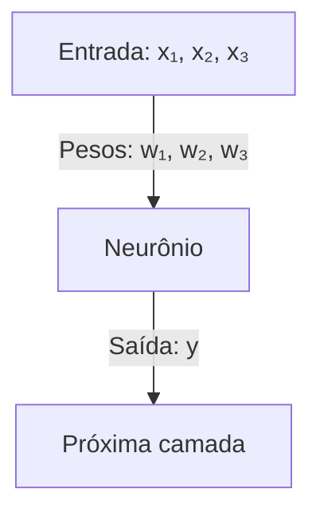
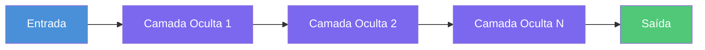
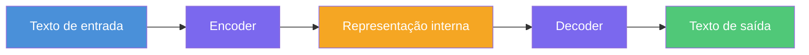
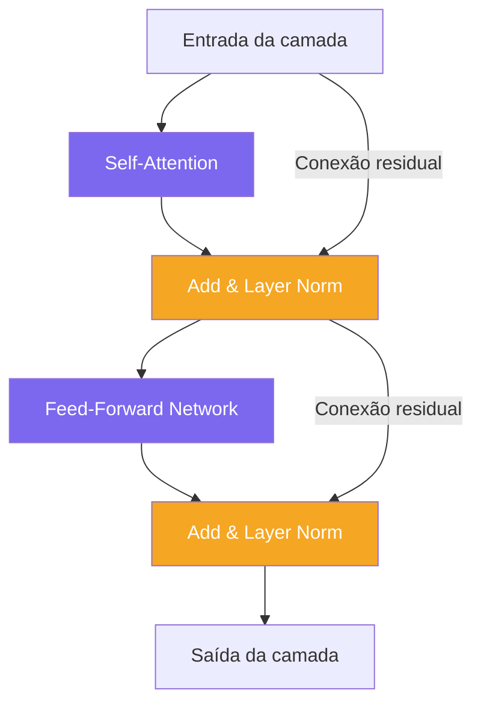
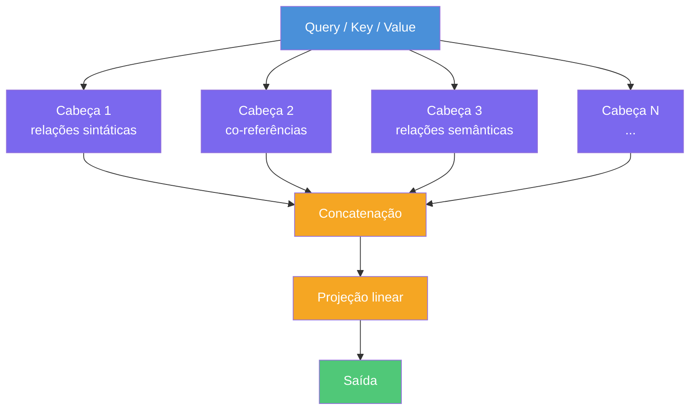
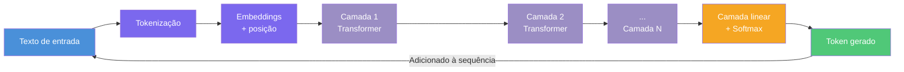

# LLMs: O que é um Transformer?
### Parte 2 — Série sobre LLMs

---

No , vimos *o que* são os LLMs, que eles fazem, uma breve história e um panorama geral de como eles funcionam por dentro.

Neste artigo vamos voltar ao *como* eles funcionam por dentro, focando na arquitetura que tornou tudo isso possível: o **Transformer**. Mas antes de chegar no coração dos LLMs — a arquitetura Transformer —, precisamos entender o terreno onde ela cresceu: o **deep learning** e as **redes neurais artificiais**.

---

## 1. Deep Learning: o campo que tornou tudo isso possível

**Deep learning** (aprendizado profundo) é uma subárea da inteligência artificial que usa o conceito de redes neurais (explicação mais adiante) com múltiplas camadas para aprender padrões a partir de dados. O "profundo" (*deep*) no nome não é metáfora: refere-se literalmente à *profundidade* dessas redes — o número de camadas empilhadas.


A ideia central é simples: em vez de programar regras manualmente (por exemplo: "se a frase contiver **'não'**, inverta o sentido"), você mostra ao sistema milhões de exemplos e deixa ele *descobrir* as regras sozinho. 

Nesse processo, a cada previsão errada, o sistema mede o erro e ajusta seus parâmetros internos para acertar mais na próxima vez — como uma criança aprendendo a falar: você não explica a gramática, só fala com ela, e ela aprende por imitação e correção.

Deep learning é a técnica por trás do reconhecimento de voz no seu celular, das recomendações do Netflix, dos carros autônomos — e dos LLMs. A diferença está no que entra como dado em cada caso: imagens, áudio ou, no caso dos modelos de linguagem, texto.

Mas como exatamente uma rede neural aprende? Para entender isso, precisamos começar pela sua unidade básica: o neurônio artificial.

---

## 2. Redes Neurais Artificiais

### A inspiração biológica

O cérebro humano tem cerca de 86 bilhões de neurônios. Cada neurônio recebe sinais elétricos de outros neurônios, e se a soma desses sinais ultrapassar um certo limiar (*threshold*, ou limite), o neurônio "dispara" — gerando um **potencial de ação**, um pulso elétrico que percorre o axônio (a "saída" do neurônio) e libera neurotransmissores nos neurônios seguintes. É uma rede de decisões em cascata, e dali emerge tudo: memória, linguagem, raciocínio...

Redes neurais artificiais são uma abstração matemática dessa ideia. Longe de simular biologia com fidelidade, elas capturam o *princípio*: 1) unidades simples conectadas em camadas, 2) onde cada conexão tem um peso que determina sua importância e 3) uma função de ativação que decide se o sinal passa adiante ou não — até gerar uma saída.



---

### O neurônio artificial

Um neurônio artificial faz três coisas:

1. **Recebe entradas** — números que representam alguma informação: a intensidade de um pixel numa imagem, a temperatura de um sensor, ou (como veremos mais adiante) a presença de uma palavra num texto. Cada entrada é um número real (veremos mais adiante como o texto vira números), e o neurônio pode ter dezenas, centenas ou milhares de entradas.
2. **Pondera e soma** — multiplica cada entrada pelo seu **peso** (*weight*): um número que o modelo aprende durante o treinamento e que representa a importância daquela entrada. Depois soma tudo, adicionando um **viés** (*bias*): uma constante que desloca o resultado para cima ou para baixo, permitindo que o neurônio ajuste sua sensibilidade independentemente das entradas — como calibrar uma balança antes de pesar algo.
3. **Aplica uma função de ativação** — passa a soma por uma função matemática que decide o que o neurônio vai "emitir" para a próxima camada, introduzindo a capacidade de capturar padrões complexos que não seguem uma linha reta.

Em forma de equação, para um neurônio com entradas `x₁, x₂, x₃`:

```
saída = f(w₁·x₁ + w₂·x₂ + w₃·x₃ + b)
```

Onde `w₁, w₂, w₃` são os pesos, `b` é o viés, `x₁, x₂, x₃` são as entradas e `f` é a função de ativação.

**Exemplo concreto:** imagine um neurônio simples tentando estimar se um e-mail é spam com base em três características: quantidade de links, presença de palavras suspeitas e tamanho da mensagem — cada uma representada por um número entre 0 e 1.

```
Entradas:  x₁ = 0.8 (muitos links)
           x₂ = 0.6 (algumas palavras suspeitas)
           x₃ = 0.2 (mensagem curta)

Pesos:     w₁ = 0.7 (links são um sinal forte de spam)
           w₂ = 0.5 (palavras suspeitas também importam)
           w₃ = 0.1 (tamanho importa menos)

Viés:      b = -0.3 (eleva o limiar de ativação: o neurônio só
                     "dispara com força" se os sinais forem suficientemente altos)

Soma:      (0.8 × 0.7) + (0.6 × 0.5) + (0.2 × 0.1) + (−0.3)
         = 0.56 + 0.30 + 0.02 − 0.30
         = 0.58

Função de ativação (ReLU): max(0, 0.58) = 0.58
```

Veja que o neurônio fez `(x₁ × w₁) + (x₂ × w₂) + ... + b` e depois aplicou a função de ativação ReLU — veremos o que ela é a seguir.

O valor `0.58` passa para a próxima camada, que continuará o processamento. Quanto mais alto esse número, mais o neurônio está "sinalizando" que algo relevante foi detectado — neste caso, indícios de spam.

Mas por que precisamos dessa função de ativação? Por que não usar a soma diretamente? A resposta revela algo fundamental sobre como redes neurais funcionam.

---

### Funções de ativação

Sem a função de ativação, empilhar camadas seria inútil — e o motivo fica claro quando você pensa no que cada camada realmente faz.

Cada camada executa uma operação simples: multiplica os números que recebe por pesos e soma uma constante (o bias). Esse tipo de operação — multiplicar por algo e somar uma constante — tem uma propriedade inconveniente: quando você encadeia várias delas em sequência, o resultado final ainda é *outra operação do mesmo tipo*. Todo o empilhamento pode ser condensado numa única etapa equivalente.

Pense assim: se você dobrar um número e depois triplicar o resultado, é o mesmo que multiplicar por seis de uma vez só. Não importa quantas multiplicações e somas você encadeie — sempre dá para condensar tudo em uma operação só.

Em notação matemática, fica assim:

```
Camada 1: f(x) = 2x + 1   → pega x, multiplica por 2, soma 1
Camada 2: g(y) = 3y − 4   → pega o resultado, multiplica por 3, subtrai 4

Composição: g(f(x)) = 3 × (2x + 1) − 4 = 6x − 1

Verificando com x = 1:
  Camada 1: f(1) = 2×1 + 1 = 3
  Camada 2: g(3) = 3×3 − 4 = 5
  Direto:   6×1 − 1       = 5   ✓ mesmo resultado
```

Duas camadas, mas o resultado é apenas `6x − 1` — uma única operação simples. Uma rede com cem camadas assim teria a mesma capacidade expressiva de uma rede com uma camada só. Todo o empilhamento seria desperdício.

E o problema vai além da redundância: operações desse tipo só conseguem representar relações *em linha reta*. Se você plotar `y = 6x − 1` num gráfico, é uma reta. Mas o mundo real raramente segue linhas retas — spam não é uma combinação linear simples de palavras, rostos não são equações lineares de pixels, e linguagem certamente não é.

**Exemplo gráfico (`y = 6x − 1`):**

```chartjs
{
  "type": "line",
  "data": {
    "datasets": [{
      "label": "y = 6x − 1",
      "data": [
        { "x": -1, "y": -7 },
        { "x": 0,  "y": -1 },
        { "x": 1,  "y": 5  },
        { "x": 2,  "y": 11 },
        { "x": 3,  "y": 17 }
      ],
      "borderColor": "#4f8ef7",
      "backgroundColor": "#4f8ef733",
      "pointRadius": 6,
      "pointHoverRadius": 8,
      "tension": 0
    }]
  },
  "options": {
    "plugins": {
      "title": {
        "display": true,
        "text": "y = 6x − 1 (função linear — sempre uma reta)"
      }
    },
    "scales": {
      "x": {
        "type": "linear",
        "title": { "display": true, "text": "x" }
      },
      "y": {
        "title": { "display": true, "text": "y" },
        "min": -10,
        "max": 20
      }
    }
  }
}
```

| x  | y = 6x − 1 |
|----|------------|
| −1 | −7         |
|  0 | −1         |
|  1 |  5         |
|  2 | 11         |
|  3 | 17         |

Retas são simples demais para capturar padrões do mundo real — que raramente são lineares. O preço de uma casa não cresce linearmente com o tamanho; o risco de uma doença não cresce linearmente com a idade; o significado de uma palavra não é uma combinação linear das letras que a compõem.
 
A função de ativação resolve isso introduzindo **não-linearidade** — um comportamento que *não* pode ser descrito por uma reta. O ReLU (*Rectified Linear Unit*), por exemplo, faz uma coisa simples: se o número for negativo, retorna zero; se for positivo, deixa passar.
 
```
ReLU(x) = max(0, x)
 
ReLU(−5) = 0      ← negativo: bloqueado
ReLU(0)  = 0      ← zero: bloqueado
ReLU(3)  = 3      ← positivo: passa como está
```
 
Agora, com ativação entre as camadas:
 
```
Camada 1 com ReLU: f(x) = max(0, 2x + 1)
Camada 2 com ReLU: g(y) = max(0, 3y − 4)
```
 
Testando com dois valores de entrada:
 
```
x = 1:
  f(1) = max(0, 2×1 + 1) = max(0, 3) = 3
  g(3) = max(0, 3×3 − 4) = max(0, 5) = 5   → saída: 5
 
x = −1:
  f(−1) = max(0, 2×(−1) + 1) = max(0, −1) = 0
  g(0)  = max(0, 3×0 − 4)    = max(0, −4) = 0   → saída: 0
```
 
Sem ativação, `x = 1` daria `6×1 − 1 = 5` e `x = −1` daria `6×(−1) − 1 = −7`. Com ativação, o valor negativo foi zerado — a rede começou a tratar regiões diferentes do espaço de forma diferente. Isso é a não-linearidade em ação: a rede agora consegue "dobrar" e "segmentar" o espaço de entradas, em vez de só esticá-lo numa reta.
 
É essa capacidade que, multiplicada por milhões de neurônios e dezenas de camadas, permite a uma rede neural aprender padrões tão complexos quanto reconhecer rostos, entender sarcasmo ou gerar texto coerente.


As funções de ativação mais comuns são:

- **Sigmoid**: `f(x) = 1 / (1 + e^(-x))` — mapeia qualquer valor para o intervalo (0, 1), o que a torna útil para representar probabilidades. Era popular em redes antigas, mas caiu em desuso em camadas internas porque sofre de *saturação*: quando os valores ficam muito grandes ou muito pequenos, o gradiente se aproxima de zero e o aprendizado trava.
- **Tanh**: `f(x) = (eˣ − e⁻ˣ) / (eˣ + e⁻ˣ)` — semelhante à sigmoid, mas mapeia para o intervalo (−1, 1). Também sofre de saturação nos extremos.
- **ReLU** (*Rectified Linear Unit*): `f(x) = max(0, x)` — simplesmente zera valores negativos e mantém os positivos intactos. É rápida, computacionalmente eficiente e evita boa parte dos problemas de saturação. Por isso, é a função de ativação padrão na maioria das redes modernas.
- **GELU** (*Gaussian Error Linear Unit*): uma versão suavizada do ReLU. Em vez de cortar abruptamente no zero, ela pondera cada valor por uma curva de probabilidade suave (baseada na distribuição normal), permitindo que valores levemente negativos contribuam um pouco para a saída. É a função preferida nos Transformers — a arquitetura por trás dos LLMs.

Exemplo de ReLU aplicada a um vetor de valores:

```
Entrada: [−1.5,  0.5,  2.0]
ReLU:    [ 0.0,  0.5,  2.0]
```

O valor negativo `−1.5` é zerado; os positivos passam sem alteração.

---
  
### Camadas: o que significa "profundo"

Um neurônio sozinho faz pouca coisa. A mágica acontece quando você organiza neurônios em **camadas** e empilha camadas em sequência.

Toda rede neural tem pelo menos três tipos de camada:

- **Camada de entrada** (*input layer*): recebe os dados brutos. Não faz cálculo — é só a porta de entrada.
- **Camadas ocultas** (*hidden layers*): é aqui que o aprendizado acontece. Cada camada transforma a representação dos dados, extraindo padrões progressivamente mais abstratos.
- **Camada de saída** (*output layer*): produz o resultado final — uma classificação, um número, uma probabilidade.



Uma rede com apenas uma camada oculta já consegue, em teoria, aproximar qualquer função matemática contínua — isso é o que o **teorema da aproximação universal** garante. Na prática, porém, seria necessário um número impraticável de neurônios para fazer isso com uma única camada. Redes *profundas* — com muitas camadas — são muito mais eficientes porque aprendem **hierarquias de padrões**: camadas iniciais detectam elementos simples (bordas numa imagem, fonemas no áudio); camadas intermediárias combinam esses elementos em estruturas maiores (formas, sílabas); camadas finais reconhecem conceitos de alto nível (rostos, palavras, intenções).

---

### Como a rede aprende: backpropagation e gradiente descendente

Uma rede neural recém-criada tem pesos aleatórios — ela chuta respostas ao acaso. O aprendizado é o processo de corrigir esses pesos com base nos erros.

O processo funciona em dois passos que se repetem milhões de vezes:

**1. Forward pass (passagem para frente)**

Os dados de entrada percorrem a rede da esquerda para a direita, camada por camada, até produzir uma saída. Essa saída é comparada com a resposta correta usando uma **função de perda** (*loss function*) — um número que mede o tamanho do erro. Quanto maior a perda, pior o chute.

```
Exemplo:
  Saída da rede: 0.3   (a rede acha que há 30% de chance de ser spam)
  Resposta correta: 1  (era spam de verdade)
  Perda: alta — a rede errou feio
```

**2. Backward pass — Backpropagation (retropropagação)**

O erro calculado na saída é propagado *de volta* pela rede, da direita para a esquerda. Para cada peso, calcula-se o quanto ele contribuiu para o erro usando cálculo diferencial — especificamente, a derivada da perda em relação a cada peso. Esse valor é chamado de **gradiente**: ele indica a direção e a magnitude do erro de cada peso.

Com os gradientes em mãos, o algoritmo de **gradiente descendente** ajusta cada peso na direção que *reduz* o erro. A intuição é geométrica: imagine a função de perda como uma paisagem montanhosa, e o objetivo é encontrar o vale mais fundo (o menor erro possível). O gradiente aponta para a subida mais íngreme — então você dá um passo na direção oposta, descendo a encosta.

```
Visualização simplificada:

  Perda
    │
  ██│
  ██│    ← ponto atual (erro alto)
  ██│ ↘
  ██│   ↘
  ██│     ↘ ← direção do gradiente descendente
  ██│       ↘
  ──┼──────────────────→ Peso
              ↑
           mínimo (menor erro)
```

O tamanho de cada passo é controlado pelo **learning rate** (taxa de aprendizado):

```
novo_peso = peso_atual − (learning_rate × gradiente)
```

Exemplo numérico:
```
peso_atual   = 0.8
gradiente    = 0.5   (o peso está contribuindo para o erro nessa magnitude)
learning_rate = 0.1  (passos pequenos para não "pular" o vale)

novo_peso = 0.8 − (0.1 × 0.5) = 0.8 − 0.05 = 0.75
```

O peso foi ajustado levemente na direção que reduz o erro. Repita isso com bilhões de exemplos, para cada um dos milhões de pesos da rede, e ela aprende. É brutalidade computacional a serviço de matemática elegante — e é exatamente essa maquinaria que está no coração dos LLMs.

### Overfitting e regularização

Um risco real no treinamento: a rede pode *memorizar* os dados de treino em vez de *generalizar* para novos dados. Isso se chama **overfitting**.

Imagine um estudante que decora todas as questões do simulado, mas não entende o conteúdo — na prova real, com questões diferentes, vai mal. É exatamente isso que acontece com uma rede em overfitting: ela acerta quase tudo nos dados que já viu, mas erra em dados novos.

```
Dados de treino:       Acerto: 99%   ← decorou
Dados novos (teste):   Acerto: 61%   ← não generalizou
```

Visualmente, a diferença entre uma rede que generaliza e uma em overfitting:

```chartjs
{
  "type": "scatter",
  "data": {
    "datasets": [
      {
        "label": "Dados",
        "data": [
          {"x": 1, "y": 2.1},
          {"x": 2, "y": 3.8},
          {"x": 3, "y": 3.2},
          {"x": 4, "y": 5.1},
          {"x": 5, "y": 4.6},
          {"x": 6, "y": 6.3},
          {"x": 7, "y": 5.9}
        ],
        "backgroundColor": "#4f8ef7",
        "pointRadius": 7
      },
      {
        "label": "Modelo (generaliza)",
        "data": [
          {"x": 0.5, "y": 1.2},
          {"x": 1.5, "y": 2.2},
          {"x": 2.5, "y": 3.1},
          {"x": 3.5, "y": 3.9},
          {"x": 4.5, "y": 4.7},
          {"x": 5.5, "y": 5.4},
          {"x": 6.5, "y": 6.1},
          {"x": 7.5, "y": 6.8}
        ],
        "type": "line",
        "borderColor": "#50C878",
        "backgroundColor": "transparent",
        "pointRadius": 0,
        "tension": 0.4,
        "borderWidth": 3
      }
    ]
  },
  "options": {
    "plugins": {
      "title": {
        "display": true,
        "text": "Generalização (bom) — curva suave que captura o padrão geral"
      },
      "legend": { "display": true }
    },
    "scales": {
      "x": { "title": { "display": true, "text": "x" }, "min": 0, "max": 8 },
      "y": { "title": { "display": true, "text": "y" }, "min": 0, "max": 8 }
    }
  }
}
```

```chartjs
{
  "type": "scatter",
  "data": {
    "datasets": [
      {
        "label": "Dados",
        "data": [
          {"x": 1, "y": 2.1},
          {"x": 2, "y": 3.8},
          {"x": 3, "y": 3.2},
          {"x": 4, "y": 5.1},
          {"x": 5, "y": 4.6},
          {"x": 6, "y": 6.3},
          {"x": 7, "y": 5.9}
        ],
        "backgroundColor": "#4f8ef7",
        "pointRadius": 7
      },
      {
        "label": "Modelo (overfitting)",
        "data": [
          {"x": 0.5, "y": 1.5},
          {"x": 1,   "y": 2.1},
          {"x": 1.5, "y": 4.8},
          {"x": 2,   "y": 3.8},
          {"x": 2.5, "y": 1.4},
          {"x": 3,   "y": 3.2},
          {"x": 3.5, "y": 6.5},
          {"x": 4,   "y": 5.1},
          {"x": 4.5, "y": 2.2},
          {"x": 5,   "y": 4.6},
          {"x": 5.5, "y": 7.2},
          {"x": 6,   "y": 6.3},
          {"x": 6.5, "y": 4.0},
          {"x": 7,   "y": 5.9},
          {"x": 7.5, "y": 7.5}
        ],
        "type": "line",
        "borderColor": "#e05252",
        "backgroundColor": "transparent",
        "pointRadius": 0,
        "tension": 0.4,
        "borderWidth": 3
      }
    ]
  },
  "options": {
    "plugins": {
      "title": {
        "display": true,
        "text": "Overfitting (ruim) — curva que passa por todos os pontos, inclusive ruídos"
      },
      "legend": { "display": true }
    },
    "scales": {
      "x": { "title": { "display": true, "text": "x" }, "min": 0, "max": 8 },
      "y": { "title": { "display": true, "text": "y" }, "min": 0, "max": 8 }
    }
  }
}
```

Algumas técnicas para combater o overfitting:

- **Dropout**: durante o treinamento, "desliga" aleatoriamente uma fração dos neurônios a cada passagem. Isso força a rede a não depender demais de nenhum neurônio específico, aprendendo representações mais robustas e distribuídas — como um time que treina com jogadores ausentes e aprende a jogar sem depender de uma estrela só.
- **Weight decay** (decaimento de pesos): penaliza pesos com valores muito altos. Pesos grandes fazem a rede reagir de forma exagerada a pequenas variações nos dados — o equivalente a decorar detalhes irrelevantes. Mantê-los pequenos força soluções mais simples e generalizáveis.
- **Early stopping**: monitora o desempenho da rede em dados que ela *não* usou para treinar. Quando esse desempenho começa a piorar — sinal de que a rede está começando a decorar em vez de aprender — o treinamento é interrompido.

---

### Da rede neural clássica ao Transformer

Redes neurais clássicas — chamadas de *feedforward networks* ou *MLPs* (*Multi-Layer Perceptrons*) — funcionam muito bem para dados tabulares e imagens. Mas texto tem uma característica especial: é **sequencial**, e o significado de uma palavra depende das outras ao redor.

Durante anos, o estado da arte para texto foram as **RNNs** (Redes Neurais Recorrentes) e suas variantes (**LSTMs**, **GRUs**), que processavam texto token por token mantendo um "estado" interno. Mas elas tinham dois problemas sérios: esqueciam contextos distantes e eram lentas de treinar, porque cada passo dependia do anterior — era impossível paralelizar.

Em 2017, o Transformer resolveu ambos os problemas de uma vez. E é nele que os LLMs vivem.

---

## 3. O que é um Transformer?

### A analogia simples

Imagine que você precisa traduzir a frase *"O banco está na margem do rio"*. Para traduzir a palavra "banco" corretamente, você precisa entender o contexto inteiro — afinal, "banco" pode ser uma instituição financeira *ou* um assento de madeira à beira d'água.

Antes de 2017, os modelos de linguagem resolviam isso lendo a frase palavra por palavra, da esquerda para a direita. O problema: ao chegar na última palavra, o modelo já havia "esquecido" parcialmente as primeiras. Frases longas eram um desastre.

Em 2017, pesquisadores do Google publicaram um artigo chamado *"Attention is All You Need"* e apresentaram o **Transformer**. A ideia central: em vez de ler sequencialmente, o modelo lê **todas as palavras ao mesmo tempo** e calcula como cada palavra se relaciona com todas as outras. Nada se perde no caminho.

### Um pouco mais a fundo

O Transformer é composto por dois blocos principais:

- **Encoder** (codificador): lê o texto de entrada e o transforma em uma representação interna densa de significado. É especialista em *compreensão* — útil para tarefas como classificação de sentimento ou busca semântica.
- **Decoder** (decodificador): usa essa representação para gerar texto de saída, token por token. É especialista em *geração* — útil para tradução, escrita e resposta a perguntas.



Modelos como o GPT usam *só* o decoder — são otimizados para gerar texto. Modelos como o BERT usam *só* o encoder — são otimizados para entender e representar texto. Modelos de tradução usam os dois.

Internamente, o Transformer é uma pilha de **camadas**. Cada camada é composta por dois mecanismos principais:

1. **Self-Attention** (atenção — veremos em detalhe no próximo tópico)
2. **Feed-Forward Network** — uma rede neural simples aplicada a cada posição de forma independente, que refina a representação produzida pela atenção



Após cada mecanismo, há duas operações de suporte:

- **Layer Normalization**: reescala os valores para uma faixa estável, evitando que os números cresçam descontroladamente durante o treinamento — um fenômeno chamado *explosão de gradientes*, que pode inviabilizar o aprendizado.
- **Conexões residuais** (*residual connections*): atalhos que somam a entrada original à saída de cada bloco. Isso garante que o gradiente consiga fluir pelas camadas sem desaparecer — um problema comum em redes muito profundas.

LLMs modernos como o GPT-4 empilham dezenas dessas camadas, com um número de parâmetros estimado em centenas de bilhões — a OpenAI nunca divulgou o número exato.

---

## 4. O que é Atenção (Self-Attention)?

### A analogia simples

Pense em como *você* lê um texto. Quando você lê "O gato sentou no tapete porque **ele** estava cansado", seus olhos voltam inconscientemente para "gato" para entender a quem "ele" se refere. Você está prestando *atenção* a partes específicas do texto ao mesmo tempo.

O mecanismo de **self-attention** faz exatamente isso — de forma matemática e simultânea para todas as palavras.

### Como funciona na prática

Para cada palavra (ou token) na sequência, o mecanismo de atenção pergunta:

> *"Quais outras palavras nesta frase são mais relevantes para entender **esta** palavra aqui?"*

O resultado é uma **pontuação de relevância** para cada par de palavras. Palavras muito relacionadas recebem pontuação alta; palavras sem relação, pontuação baixa. Essas pontuações são normalizadas com uma função *softmax* — que as converte em números entre 0 e 1 que somam 1, como probabilidades. O modelo então usa essas pontuações para criar uma representação mais rica de cada palavra, misturando informações das palavras mais relevantes.

Exemplo com a frase *"O gato sentou no tapete porque ele estava cansado"*:

```
Calculando atenção para o token "ele":

  "ele" → "gato":    0.72  ← alta atenção (são co-referentes)
  "ele" → "sentou":  0.10
  "ele" → "tapete":  0.03
  "ele" → "porque":  0.05
  "ele" → "cansado": 0.10
                     ────
                     1.00  ← somam 1 (após softmax)
```

O modelo "sabe" que "ele" se refere a "gato" porque aprendeu, durante o treinamento, que pronomes tendem a se ligar a substantivos próximos com alta pontuação de atenção.

### O mecanismo matemático: Queries, Keys e Values

Por baixo dos panos, o self-attention usa três vetores para cada token:

- **Query (Q):** a "pergunta" que o token faz — *"quais outros tokens são relevantes para mim?"*
- **Key (K):** o "rótulo" de cada token — *"que tipo de informação eu ofereço?"*
- **Value (V):** a informação real que será passada adiante, caso o token seja considerado relevante

A analogia com uma busca ajuda: Q é o termo que você digita, K são os títulos dos resultados, e V é o conteúdo das páginas. A atenção mede a compatibilidade entre Q e cada K, e usa esses pesos para decidir quanto de cada V incorporar.

Exemplo com a frase *"O gato sentou no tapete"*:

```
Token analisado: "sentou"

Query de "sentou":  [0.8, 0.2, ...]   → "preciso de um sujeito"
Key de "gato":      [0.7, 0.3, ...]   → "sou um substantivo, possível sujeito"
Key de "tapete":    [0.1, 0.9, ...]   → "sou um objeto"

Compatibilidade:
  "sentou" ↔ "gato":   alta   → V de "gato" contribui muito
  "sentou" ↔ "tapete": baixa  → V de "tapete" contribui pouco
```

Em notação matemática:

```
Attention(Q, K, V) = softmax(QKᵀ / √d_k) × V
```

- `QKᵀ` — produto entre Queries e Keys: mede a compatibilidade entre cada par de tokens
- `√d_k` — divisor que estabiliza os valores antes do softmax, evitando que números muito grandes tornem os gradientes instáveis
- `softmax(...)` — converte as pontuações em pesos que somam 1
- `× V` — usa esses pesos para combinar os Values: tokens mais relevantes contribuem mais

### Multi-Head Attention

Na prática, o modelo não executa esse mecanismo uma vez só — ele o executa **múltiplas vezes em paralelo**, cada vez com um conjunto diferente de Q, K e V. Cada execução paralela é chamada de **cabeça de atenção** (*attention head*).

A intuição: cada cabeça aprende a prestar atenção a um tipo diferente de relação entre as palavras. Uma cabeça pode focar em relações sintáticas (qual palavra é o sujeito do verbo?); outra, em co-referências (a quem esse pronome se refere?); outra, em relações semânticas (quais palavras têm significados relacionados?).



Os resultados de todas as cabeças são concatenados e passados por uma camada linear que os combina de volta ao tamanho original. Isso é o **Multi-Head Attention** — a razão pela qual os Transformers conseguem capturar relações tão ricas e variadas simultaneamente.

---

## 5. O que são Tokens e Embeddings?

### Tokens: as peças do quebra-cabeça

Computadores não entendem letras ou palavras diretamente — só entendem números. Então, antes de qualquer processamento, o texto precisa ser convertido em unidades chamadas **tokens**.

Um token não é necessariamente uma palavra. Dependendo do algoritmo de tokenização, pode ser:

- Uma palavra inteira: `"gato"` → `[1423]`
- Uma parte de palavra: `"transformador"` → `["transform", "ador"]` → `[892, 211]` *(divisão ilustrativa)*
- Um caractere individual
- Um símbolo de pontuação

O algoritmo mais comum hoje é o **Byte-Pair Encoding (BPE)**, que parte de caracteres individuais e iterativamente une os pares mais frequentes, chegando a um vocabulário de ~50.000 a ~100.000 tokens. Palavras comuns viram um único token; palavras raras são divididas em partes menores.

```
Frase: "Os transformadores mudaram a IA"

Tokens (ilustrativo):
  "Os"             → [  512]
  " transform"     → [ 4231]
  "adores"         → [  892]
  " mud"           → [ 1847]
  "aram"           → [  334]
  " a"             → [  257]
  " IA"            → [ 9143]

Total: 7 tokens para 6 palavras
```

Por isso, quando você usa um modelo de linguagem, o número de tokens processados é diferente do número de palavras. Em inglês, a proporção é aproximadamente 1 palavra ≈ 1,3–1,5 tokens. Em português — e na maioria das línguas não-inglesas — a proporção é maior, frequentemente 2–3 tokens por palavra, porque o vocabulário do BPE é treinado majoritariamente em inglês.

### Embeddings: transformando tokens em significado

Um token é só um número de índice — `1423` não diz nada sobre o que "gato" significa, ou como ele se relaciona com "felino" ou "animal".

É aí que entram os **embeddings**.

Um embedding é um **vetor de números reais** com centenas ou milhares de dimensões. Cada token é mapeado para um desses vetores — e durante o treinamento, o modelo aprende a posicionar tokens semanticamente similares em regiões próximas desse espaço multidimensional.

Aqui simplificamos para apenas duas dimensões, com rótulos intuitivos: *animal* (o quanto a palavra se relaciona com seres vivos) e *realeza* (o quanto se relaciona com poder e nobreza):

```
  animal
    │
  2 │   • gato  • felino
    │
  1 │                    • rei  • rainha
    │   • astronauta
  0 │
    └─────────────────────────────────── realeza
        0         1         2
```

As coordenadas de cada palavra nesse espaço:

```
               animal  realeza
  "gato"      →  2.0,    0.2   (muito animal, pouca realeza)
  "felino"    →  2.0,    0.5   (muito animal, pouca realeza)
  "rei"       →  1.0,    1.7   (moderadamente animal, muita realeza)
  "rainha"    →  1.0,    2.0   (moderadamente animal, muita realeza)
  "astronauta"→  0.3,    0.2   (pouco animal, pouca realeza)
```

Lendo o gráfico:

- `"gato"` e `"felino"` pontuam alto em *animal* e baixo em *realeza* — ficam no canto superior esquerdo, próximos entre si.
- `"rei"` e `"rainha"` pontuam alto em *realeza* e moderadamente em *animal* (afinal, humanos são animais) — ficam à direita e abaixo, próximos entre si mas distantes de `"gato"`.
- `"astronauta"` pontua baixo em ambos os eixos — não é um conceito de animal nem de realeza — e fica isolado no canto inferior esquerdo.

Na prática, um embedding real tem centenas ou milhares dessas dimensões, cada uma capturando algum aspecto do significado — sem rótulos explícitos. O modelo os descobre sozinho durante o treinamento.

A proximidade entre dois pontos é o que o modelo usa como medida de similaridade semântica. Quanto mais próximos no espaço, mais relacionados o modelo os considera.

Um resultado clássico que ilustra a riqueza desse espaço:

```
vetor("rei") − vetor("homem") + vetor("mulher") ≈ vetor("rainha")
```

O modelo não foi programado para saber isso — emergiu do treinamento. É matemática de significado: as relações entre conceitos ficam codificadas como direções no espaço vetorial.

### Embeddings posicionais

O Transformer processa todos os tokens ao mesmo tempo — então, por padrão, ele não sabe a *ordem* em que os tokens aparecem. A frase "o gato comeu o rato" e "o rato comeu o gato" teriam os mesmos tokens, em ordens diferentes.

Para resolver isso, são adicionados **embeddings posicionais**: vetores que codificam a posição de cada token na sequência.

```
Token 1: embedding("O")    + posição(1)
Token 2: embedding("gato") + posição(2)
Token 3: embedding("comeu")+ posição(3)
...
```

O artigo original do Transformer usava funções seno e cosseno fixas para codificar posições. Modelos modernos usam variantes aprendidas durante o próprio treinamento — como **RoPE** (*Rotary Position Embedding*), usada no LLaMA e em muitos LLMs recentes — que generalizam melhor para sequências longas.

---
## 6. O Pipeline Completo: Input → Embedding → Camadas → Output

Agora que entendemos os componentes, vamos acompanhar o caminho que sua pergunta percorre dentro do modelo, do início ao fim.



---

### Etapa 1 — Tokenização

```
"Qual a capital do Brasil?"
→ ["Qual", " a", " capital", " do", " Brasil", "?"]
→ [4821,  290,   3124,       466,   15300,     30]
```

A frase é quebrada em tokens e cada token é convertido em um índice inteiro.

---

### Etapa 2 — Embedding

```
[4821,  290,  3124,  466,  15300,  30]
  ↓      ↓     ↓      ↓      ↓     ↓
 v₁     v₂    v₃     v₄     v₅    v₆     ← vetores de 4096 dimensões

+ embeddings posicionais:
 p₁     p₂    p₃     p₄     p₅    p₆     ← codificam a ordem

= entrada para o Transformer:
 v₁+p₁  v₂+p₂  v₃+p₃  v₄+p₄  v₅+p₅  v₆+p₆
```

Cada índice é substituído pelo seu vetor de embedding. Os embeddings posicionais são somados a esses vetores, inserindo informação sobre a ordem dos tokens.

---

### Etapa 3 — Camadas do Transformer

Os vetores passam por dezenas de camadas empilhadas. Em cada camada:

```
      ┌─────────────────────────────┐
      │                             │
  Entrada                           │  (conexão residual)
      │                             │
      ▼                             │
  Multi-Head Self-Attention ────────┘
      │
      ▼
  Add & Layer Norm
      │                             │  (conexão residual)
      ▼                             │
  Feed-Forward Network ─────────────┘
      │
      ▼
  Add & Layer Norm
      │
      ▼
  Saída (vetores mais ricos)
```

1. **Multi-Head Self-Attention:** cada token atualiza sua representação olhando para todos os outros tokens e pesando sua influência.
2. **Add & Norm:** a entrada da camada é somada à saída da atenção (conexão residual) e normalizada.
3. **Feed-Forward Network:** uma rede neural simples refina a representação de cada token independentemente.
4. **Add & Norm:** novamente, conexão residual e normalização.

A cada camada, os vetores ficam mais ricos e contextualizados. Camadas iniciais tendem a capturar padrões sintáticos simples; camadas mais profundas capturam relações semânticas abstratas.

---

### Etapa 4 — Output: a camada de linguagem

Após a última camada, o modelo pega o vetor da última posição e passa por uma **camada linear** que o projeta de volta ao tamanho do vocabulário (ex: 50.000 dimensões), seguida de uma **função softmax** que transforma esses valores em probabilidades:

```
Candidatos para o próximo token após "Qual a capital do Brasil":

  "Brasília"   → 62.3%   ← vencedor
  "São Paulo"  →  8.1%
  "Brasil"     →  5.4%
  "a"          →  4.2%
  "é"          →  3.8%
  ...outros ~50.000 tokens com probabilidades muito baixas
```

O modelo escolhe o próximo token de uma de duas formas:
- **Greedy decoding:** sempre escolhe o token com maior probabilidade (`"Brasília"`).
- **Amostragem com temperature:** sorteia entre os candidatos de forma ponderada. Com temperature alta, escolhas menos prováveis ganham mais chance — o modelo fica mais "criativo" (e às vezes menos preciso). Com temperature baixa, o modelo fica mais conservador e determinístico.

O token escolhido é adicionado à sequência, e o processo se repete — agora com `"Qual a capital do Brasil? Brasília"` como entrada — até o modelo gerar um token especial de fim (`<|endoftext|>`) ou atingir o limite máximo de tokens.

---

### O Diagrama Mental Completo

```
╔══════════════════════════════════════╗
║         TEXTO DE ENTRADA             ║
║    "Qual a capital do Brasil?"       ║
╚══════════════════════════════════════╝
                  ↓
╔════════════════════════════════════════════════╗
║            TOKENIZADOR                         ║
║  "Qual" " a" " capital" " do" " Brasil" "?"    ║
║   4821   290   3124       466   15300   30     ║
║                                                ║
╚════════════════════════════════════════════════╝
                  ↓
╔════════════════════════════════════════════╗
║  TABELA DE EMBEDDINGS + POSICIONAIS        ║
║                                            ║
║  token[4821] → v₁ + p₁                     ║
║  token[290] → v₂ + p₂                      ║
║  token[3124] → v₃ + p₃                     ║
║       ...    → ...                         ║
║                                            ║
║  6 vetores de 4096 dimensões cada          ║
╚════════════════════════════════════════════╝
                  ↓
╔══════════════════════════════════════╗
║              CAMADA 1                ║
║ ┌────────────────────────────────┐   ║
║ │  Multi-Head Self-Attention     │   ║
║ │  cada token olha para todos    │   ║
║ │  os outros e pondera           │   ║
║ │  sua influência                │   ║
║ └────────────────────────────────┘   ║
║              Add & Norm              ║
║ ┌────────────────────────────────┐   ║
║ │  Feed-Forward Network          │   ║
║ │  refina cada token             │   ║
║ │  independentemente             │   ║
║ └────────────────────────────────┘   ║
║              Add & Norm              ║
╚══════════════════════════════════════╝
                  ↓
╔══════════════════════════════════════╗
║              CAMADA 2                ║
║         (mesma estrutura)            ║
║    vetores ficam mais ricos          ║
║    e contextualizados                ║
╚══════════════════════════════════════╝
                  ↓
                 ...
                  ↓
╔══════════════════════════════════════╗
║              CAMADA N                ║
║         (mesma estrutura)            ║
║   padrões abstratos e semânticos     ║
║   plenamente capturados              ║
╚══════════════════════════════════════╝
                  ↓
╔══════════════════════════════════════╗
║       CAMADA LINEAR (projeção)       ║
║                                      ║
║  vetor de 4096 dim                   ║
║       → 50.000 dim (vocabulário)     ║
╚══════════════════════════════════════╝
                  ↓
╔══════════════════════════════════════╗
║              SOFTMAX                 ║
║                                      ║
║  "Brasília"  → 62.3%  ← vencedor     ║
║  "São Paulo" →  8.1%                 ║
║  "Brasil"    →  5.4%                 ║
║  "a"         →  4.2%                 ║
║  ...                                 ║
╚══════════════════════════════════════╝
                  ↓
╔══════════════════════════════════════╗
║           TOKEN GERADO               ║
║             "Brasília"               ║
╚══════════════════════════════════════╝
                  ↓
    adicionado à sequência de entrada
                  ↓
╔══════════════════════════════════════╗
║  "Qual a capital do Brasil?          ║
║   Brasília"  → volta ao início       ║
║                                      ║
║  repete até <|endoftext|>            ║
║  ou limite máximo de tokens          ║
╚══════════════════════════════════════╝
```
---

## Conclusão

Os LLMs modernos são, em essência, máquinas muito bem treinadas para prever o próximo token. A genialidade não está em uma única ideia, mas na combinação elegante de vários mecanismos:

- **Redes neurais e deep learning** são o alicerce: unidades simples organizadas em camadas profundas que aprendem ajustando pesos via backpropagation e gradiente descendente, extraindo hierarquias de padrões cada vez mais abstratos.
- **Tokens e embeddings** traduzem linguagem em matemática — palavras viram vetores, e significado vira geometria.
- **Self-attention** permite que o modelo entenda contexto e relações entre palavras de forma global e simultânea, sem perder nada pelo caminho.
- **O Transformer** combina tudo isso numa arquitetura que resolveu os problemas das redes recorrentes e se tornou a espinha dorsal dos LLMs modernos.
- **O pipeline de geração** converte esse entendimento em texto fluente e coerente, um token de cada vez, repetindo o processo até a resposta estar completa.

O que parece mágica é, no fundo, álgebra linear, cálculo diferencial e estatística aplicados em escala monumental — bilhões de parâmetros aprendidos a partir de trilhões de palavras, numa arquitetura que coube em oito páginas de artigo científico. Esse artigo, *"Attention is All You Need"*, foi publicado por pesquisadores do Google em 2017 e mudou o mundo.

---